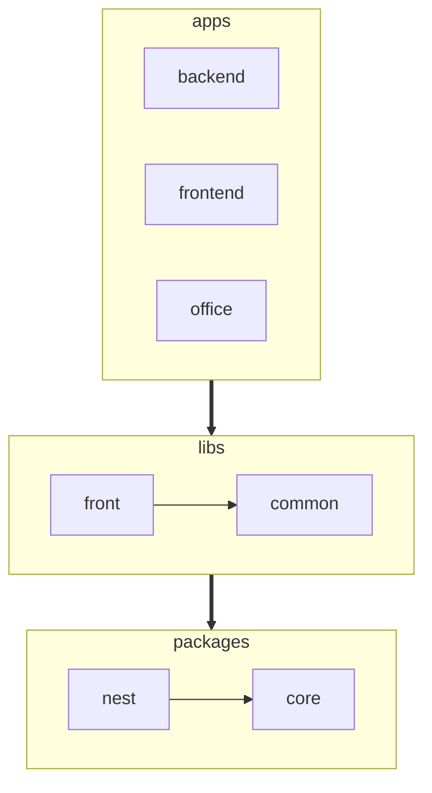
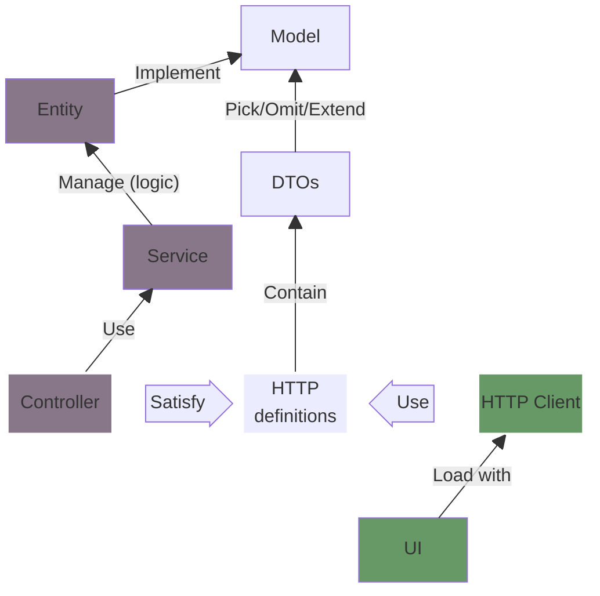
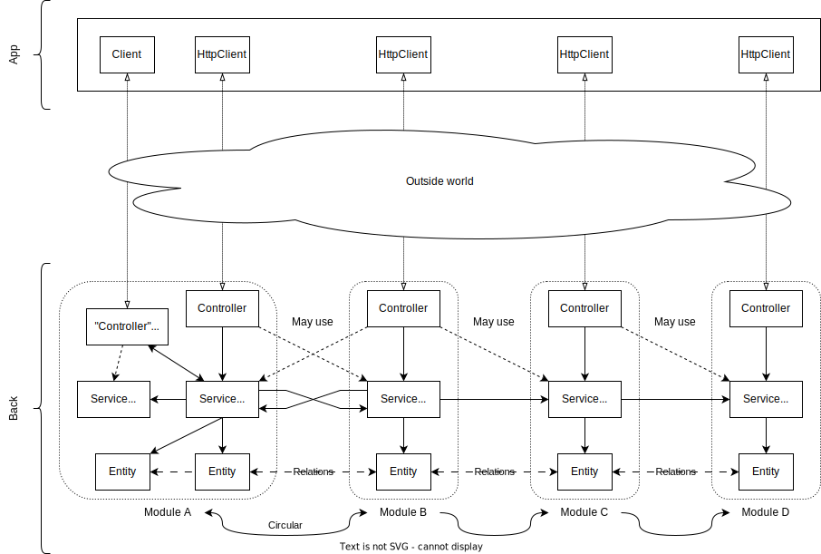

# Structure / Architecture

## Global

"levels"

```mermaid
flowchart TD
 subgraph apps
  backend
  frontend
  office
 end

 subgraph libs
  common
  front

  front --> common
 end

 subgraph packages
  core
  nest

  nest --> core
 end

 apps ==> libs
 libs ==> packages

```

## Hierarchy

```mermaid
block-beta
 columns 5

 space:2 Model space:2
 Entity space:4
 space:2 DTOs space:2
 space:1 Service space:3
 space:5
 Controller c2h<["Satisfy"]>(right) Http["HTTP\ndefinitions"] hc2h<["Use"]>(left) HttpClient["HTTP Client"]
 space:5
 space:3 UI

 DTOs --"Pick/Omit/Extend"--> Model
 Http --"Contain"--> DTOs

 Entity --"Implement"--> Model
 Service --"Manage (logic)"--> Entity
 Controller --"Use"--> Service

 UI --"Load with"--> HttpClient

 classDef front fill: #696,stroke: #333;
 classDef back fill: #878,stroke: #333;
 class UI,HttpClient front
 class Entity,Service,Controller back

 classDef http_layer ,stroke: #fff,stroke-width: 5px;
 class Http,HttpClient,Controller http_layer
```

## Backend module

